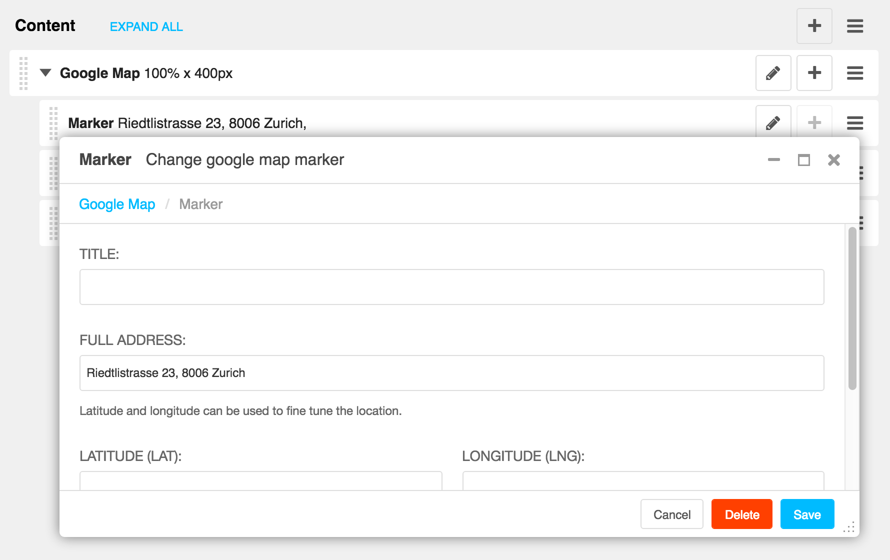

=====================
django CMS Google Map
=====================

|pypi| |build| |coverage|

**django CMS Google Map** is a set of plugins for `django CMS <http://django-cms.org>`_
that allow you to implement `Google Map <https://developers.google.com/maps/>`_ into your website.

This addon is compatible with `Divio Cloud <http://divio.com>`_ and is also available on the
`django CMS Marketplace <https://marketplace.django-cms.org/en/addons/browse/djangocms-googlemap/>`_
for easy installation.

Contributing
============

This is a an open-source project. We'll be delighted to receive your
feedback in the form of issues and pull requests. Before submitting your
pull request, please review our `contribution guidelines
<http://docs.django-cms.org/en/latest/contributing/index.html>`_.

One of the easiest contributions you can make is helping to translate this addon on
`Transifex <https://www.transifex.com/projects/p/djangocms-googlemap/>`_.

Documentation
=============

See ``REQUIREMENTS`` in the `setup.py <https://github.com/divio/djangocms-googlemap/blob/master/setup.py>`_
file for additional dependencies:

* Python 2.7, 3.3 or higher
* Django 1.8 or higher

Installation
------------

For a manual install:

* run ``pip install djangocms-googlemap``
* add ``djangocms_googlemap`` to your ``INSTALLED_APPS``
* run ``python manage.py migrate djangocms_googlemap``

Configuration
-------------

django CMS Google Map **requires** an
`API key from Google <https://developers.google.com/maps/documentation/embed/guide>`_,
that needs to be supplied in your Django settings: ::

    DJANGOCMS_GOOGLEMAP_API_KEY = ''

Note that the provided templates are minimal by design. You are encouraged
to adapt and override them to your project's requirements. The included
demo JavaScript does not require jQuery or any other 3rd party library
other than Google Maps own JavaScript, which will be loaded automatically.

This addon provides a ``default`` template for all instances. You can provide
additional template choices by adding a ``DJANGOCMS_GOOGLEMAP_TEMPLATES``
setting::

    DJANGOCMS_GOOGLEMAP_TEMPLATES = [
        ('feature', _('Featured Version')),
    ]

You'll need to create the `feature` folder inside ``templates/djangocms_googlemap/``
otherwise you will get a *template does not exist* error. You can do this by
copying the ``default`` folder inside that directory and renaming it to
``feature``.

Running Tests
-------------

You can run tests by executing::

    virtualenv env
    source env/bin/activate
    pip install -r tests/requirements.txt
    python setup.py test

.. |pypi| image:: https://badge.fury.io/py/djangocms-googlemap.svg
    :target: http://badge.fury.io/py/djangocms-googlemap
.. |build| image:: https://travis-ci.org/divio/djangocms-googlemap.svg?branch=master
    :target: https://travis-ci.org/divio/djangocms-googlemap
.. |coverage| image:: https://codecov.io/gh/divio/djangocms-googlemap/branch/master/graph/badge.svg
    :target: https://codecov.io/gh/divio/djangocms-googlemap
